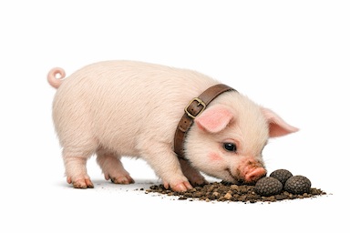
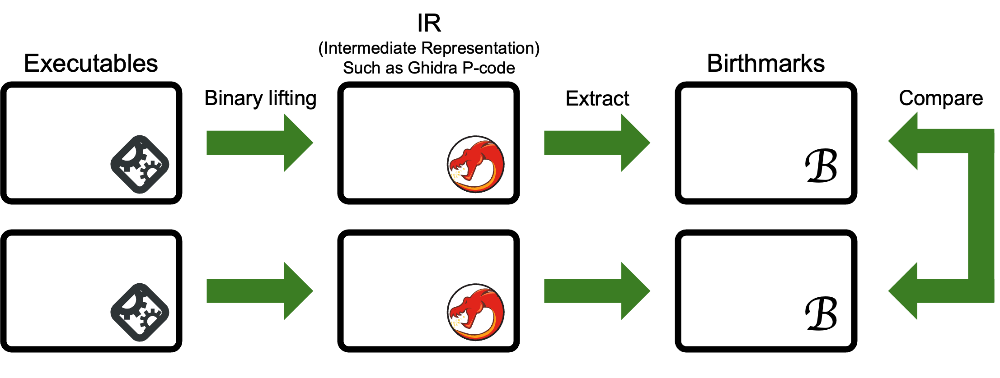

# oinkie 🐽🐷🐖

Detecting software theft, the birthmark toolkit for Ghidra Pcode, LLVM IR/BC, and Binary Ninja.

## 🗣️ Overview

Software theft is difficult to detect because it is conducted stealthily, and the source code of the stolen software remains private.
Compilers and their options sensitively alter the binary formats (including executables) of software.
The problem is further complicated by the vast amount of software worldwide.
Therefore, we need a method to detect software theft targeting binary formats from large software repositories.

For this, Tamada et al. proposed the concept of software birthmarking in 2004.
It refers to the native characteristics of the programs and allows for comparison between them.
The similarities of the two birthmarks reflect how similar the original programs are.

This toolkit extracts them from the binary code and compares them to calculate the similarities between two birthmarks.
The high similarity suggests that either program is suspected of being a copy of the other.

- [Usage of the CLI interface](cli/README.md)

## What is the software birthmark?

A software birthmark is a unique characteristic of a software program that can be used to identify it.
It is derived from the binary code of the software and can be used to detect software theft by comparing the birthmarks of different programs.

## 🚶​ Procedures of Birthmarking with `oinkie`

To examine the birthmarks, we apply the following steps:

1. Collects the binary files to be examined.
2. Lifts binary files to an intermediate representation (IR), such as Ghidra PCODE or LLVM IR/BC.
3. Extracts the birthmarks from the lifted IR files.
4. Compares the birthmarks to calculate the similarities.
5. Analyze the results to determine if software theft is suspected.

### 1️⃣ Collects the binary files to be examined

At first, we should collect the binary files to examine the targets.
Note that `oinkie` does not care about the binary formats; it only looks at the intermediate representation (IR), which is called the Oinkie IR format (OIR format).

### 2️⃣​ Lifts the binary files to the intermediate representation (IR)

Next, we should lift the binary files to the OIR format.
The current version of `oinkie` was only tested by lifting with [Ghidra](https://www.ghidradocs.com) and generated the OIR format.
The future version will support [LLVM IR/BC](https://llvm.org) and [Binary Ninja](https://binary.ninja).

See also ([`lifter/README.md`](lifter/README.md)).

### 3️⃣ Extracts the birthmarks from the lifted IR files

The next step is to extract the birthmarks from the lifted IR files.
Various types of birthmarks have been proposed, such as a sequence of opcodes, $k$-gram-based birthmarks, etc.
The `oinkie` supports the following birthmark types:

- function calls
- opcode
- $k$-gram of opcode

In each type, the birthmark structures are: sequences, frequencies, and sets.
Then, the birthmark types are combinations of the above types and structures, such as "function calls with frequency (`fc-freq`)" and "opcode $k$-gram with sequence. (`op-3gram-seq`)".

### 4️⃣ Compares the birthmarks to calculate the similarities

The next step is to compare the extracted birthmarks and calculate the similarities.
In this step, there are various options to consider for determining the comparison pairs and
the similarity calculation algorithm to use.

For more details, see ([`cli/README.md`](cli/README.md)).

#### 🧦 Paring strategy

- All and self,
- All,
- SelfCoverage,
- Adjacent, and
- FirstVsOthers.

#### 🪞 Similarity calculation algorithm

- Cosine similarity,
- Dice index,
- Euclidean,
- Jaccard index,
- Levenshtein similarity,
- LCS (Longest common subsequence) similarity,
- Simpson index, and
- Weighted Jaccard index.

### 5️⃣ Analyze the results to determine if software theft is suspected

Finally, we examine the similarity scores with the content and birthmarks of both programs to determine whether plagiarism has occurred.

Generally, if the similarity exceeds a certain threshold, it is suspected of being a copy.
From past research, the typical threshold is 0.75.

Note that the birthmark method just detects potential copies; it does not prove that plagiarism has occurred.

## ℹ️ About

### 📛 The origin of the tool name `oinkie`

The previous version of this tool is [`pochi`](https://github.com/tamada/pochi), which is the birthmark toolkit for the JVM platform. The `pochi` is a dog that said "dig dig, here" and finds the treasures in the Japanese old tale "The old man who made flowers bloom." The tool finds clues of piracy from the binary code, as illustrated by the example of the dog above.

The purpose of `oinkie` is the same as `pochi`'s on the other platform: LLVM IR/BC. Hence, another tool name is wanted, such as an animal, a concept, or a famous person. From this background, I came up with the idea of a pig finding a truffle. However, truffle is already used in [GraalVM](https://www.graalvm.org/latest/graalvm-as-a-platform/language-implementation-framework/). Then I asked Microsoft Copilot, "What is the famous name of the truffle pig?" The name `oinkie` is one answer to the question.

### 🎃 The logo of `oinkie`

This is the logo of `oinkie` which illustrates a pig searching for truffles.
This illustration is generated by Microsoft Copilot.

### 📃 Academic Papers

#### 📜 By myself

1. Haruaki Tamada, Masahide Nakamura, Akito Monden, and Kenichi Matsumoto, ''Design and Evaluation of Birthmarks for Detecting Theft of Java Programs,'' Proc. IASTED International Conference on Software Engineering (IASTED SE 2004), pp. 569--575, February 2004 (Innsbruck, Austria). 
    - proposed a concept of software birthmarks, and the birthmark types of CVFV, UC, SMC, and IS.
2. Haruaki Tamada, Keiji Okamoto, Masahide Nakamura, Akito Monden, and Kenichi Matsumoto, ''Dynamic Software Birthmarks to Detect the Theft of Windows Applications,'' Proc. International Symposium on Future Software Technology 2004 (ISFST 2004), October 2004 (Xi'an, China).
    - proposed a concept of dynamic software birthmarks, and the birthmark types of EXESEQ and EXEFREQ.
3. Haruaki Tamada, Masahide Nakamura, Akito Monden, and Ken-ichi Matsumoto, ''Java Birthmarks --Detecting the Software Theft--,'' IEICE Transactions on Information and Systems, Vol. E88-D, No. 9, pp. 2148--2158, September 2005. 
    - proposed a concept of static software birthmarks, and the birthmark types of CVFV, UC, and SMC.
4. Takehiro Tsuzaki, Teruaki Yamamoto, Haruaki Tamada, and Akito Monden, ''A Fuzzy Hashing Technique for Large Scale Software Birthmarks,'' Proc. 15th IEEE/ACIS International Conference on Computer and Information Science ([ICIS 2016](https://www.acisinternational.org/icis2016/)), pp. 867--872, July 2016 (Okayama, Japan). 
    - Introduce the fuzzy hash technique to speed up birthmark comparisons.
5. Jun Nakamura and Haruaki Tamada, ''Fast Comparison of Software Birthmarks for Detecting the Theft with the Search Engine,'' Proc. of the 4th International Conference on Applied Computing & Information Technology (ACIT 2016), pp. 152--157, December 2016 (UNLV, Las Vegas, NV, USA). 
    - Introduce a search engine to speed up comparisons.
6. Jun Nakamura and Haruaki Tamada, ''mituba: Scaling up Software Theft Detection with the Search Engine,'' Proc. International Conference on Software Engineering and Information Management ([ICSIM 2018](http://www.icsim.org/icsim2018.html)), pp. 6--10, January 2018 (Casablanca, Morocco). 
    - Upgrading the method of ACIT 2016.
7. Nikolay Fedorov, Hiroki Inayoshi, Haruaki Tamada, Akito Monden, ''Comparison of Similarity Functions for n-gram Software Birthmarks,'' The 6th World Symposium on Software Engineering ([WSSE 2024](https://wsse.org/)), pp. 169--176, September 2024 (Kyoto, Japan). 

#### 📄 Popular papers on software birthmarks

##### $k$-gram-based birthmarks

- Ginger Myles and Christian Collberg, "$k$-gram-based software birthmarks," In Proc. the 2005 ACM Symposium on Applied Computing, pp.314--318, March 2005. 

##### Whole Program Path (Dynamic Software Birthmarks)

- Ginger Myles and Christian Collberg, "Detecting Software Theft via Whole Program Path Birthmarks," In Proc. International Conference on Information Security 2004, pp.404–-415, 2004. 

#### Surveys on software birthmarks

- Christian Collberg and Jasvir Nagra "Surreptitious Software: Obfuscation, Watermarking, and Tamperproofing for Software ProtectionAugust," Addison-Wesley Professional, ISBN:978-0-321-54925-9, August 2009. 
- Shah Nazir, Sara Shahzad and Neelam Mukhtar, "Software Birthmark Design and Estimation: A Systematic Literature Review," Arabian Journal for Science and Engineering, Vol.44, pp.3905–-3927, January 2019. 
