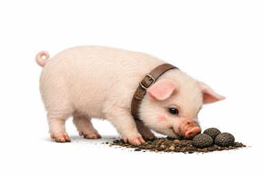
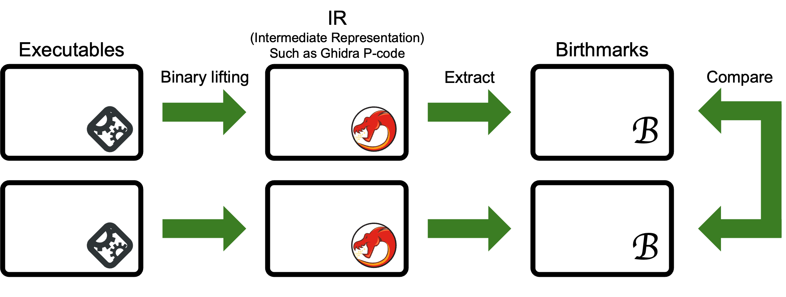

# oinkie 🐽🐷🐖

[](https://github.com/tamada/oinkie/releases/tag/v0.8.0)
[](https://github.com/tamada/oinkie/blob/main/LICENSE)

[](https://coveralls.io/github/tamada/oinkie)
[](https://sonarcloud.io/summary/new_code?id=tamada_oinkie)

[](https://quay.io/repository/tama5/oinkie)

Detects software theft by comparing birthmarks extracted from binaries, lifted by Ghidra, Binary Ninja or IDA Pro.



## 🗣️ Overview

Software theft is difficult to detect because it is conducted stealthily, and the source code of the stolen software remains private.
Compilers and their options sensitively alter the binary formats (including executables) of software.
The problem is further complicated by the vast amount of software worldwide.
Therefore, we need a method to detect software theft targeting binary formats from large software repositories.

For this, Tamada et al. proposed the concept of software birthmarking in 2004.
It refers to the native characteristics of the programs and allows for comparison between them.
The similarities of the two birthmarks reflect how similar the original programs are.

This toolkit extracts them from the binary code and compares them to calculate the similarities between two birthmarks.
The high similarity suggests that either program is suspected of being a copy of the other.

- [Usage of the CLI interface](cli/README.md)
- [Serving oinkie to an agent over MCP](cli/mcp/README.md)
- [Using oinkie as a library](#-using-oinkie-as-a-library)

## What is the software birthmark?

A software birthmark is a unique characteristic of a software program that can be used to identify it.
It is derived from the binary code of the software and can be used to detect software theft by comparing the birthmarks of different programs.

## 🚶​ Procedures of Birthmarking with `oinkie`

To examine the birthmarks, we apply the following steps:

1. Collects the binary files to be examined.
2. Lifts binary files to an intermediate representation (IR), such as Ghidra's P-code.
3. Extracts the birthmarks from the lifted IR files.
4. Compares the birthmarks to calculate the similarities.
5. Analyze the results to determine if software theft is suspected.

The terms used here and in the documentation are defined in the [Glossary](https://tamada.github.io/oinkie/glossary/).



### 1️⃣ Collects the binary files to be examined

At first, we should collect the binary files to examine the targets.
Note that `oinkie` does not care about the binary formats; it only looks at the intermediate representation (IR), which is called the Oinkie IR format (OIR format).

### 2️⃣​ Lifts the binary files to the intermediate representation (IR)

Next, we should lift the binary files to the OIR format.
`oinkie` lifts with [Ghidra](https://www.ghidradocs.com), to its P-Code; with
[Binary Ninja](https://binary.ninja), to any of its three intermediate
languages; and with [IDA Pro](https://hex-rays.com/ida-pro), to the Hex-Rays
microcode. Each is a separate representation and birthmarks are not compared
across them.

See also ([`assets/lifters/README.md`](assets/lifters/README.md)), and each
backend's own notes: ([Ghidra](assets/lifters/ghidra/README.md)),
([Binary Ninja](assets/lifters/binaryninja/README.md)),
([IDA Pro](assets/lifters/ida/README.md)).

### 3️⃣ Extracts the birthmarks from the lifted IR files

The next step is to extract the birthmarks from the lifted IR files.
Various types of birthmarks have been proposed, such as a sequence of opcodes, $k$-gram-based birthmarks, etc.
The `oinkie` supports the following birthmark types:

- function calls
- opcode
- $k$-gram of opcode

In each type, the birthmark structures are: sequences, frequencies, and sets.
Then, the birthmark types are combinations of the above types and structures, such as "function calls with frequency (`fc-freq`)" and "opcode $k$-gram with sequence. (`op-3gram-seq`)".

### 4️⃣ Compares the birthmarks to calculate the similarities

The next step is to compare the extracted birthmarks and calculate the similarities.
In this step, there are various options to consider for determining the comparison pairs and
the similarity calculation algorithm to use.

For more details, see ([`cli/README.md`](cli/README.md)).

#### 🧦 Pairing strategy

- All and self,
- All,
- SelfCoverage,
- Adjacent,
- FirstVsOthers, and
- LastVsOthers.

#### 🪞 Similarity calculation algorithm

- Cosine similarity,
- Dice index,
- Euclidean,
- Jaccard index,
- Levenshtein similarity,
- LCS (Longest common subsequence) similarity,
- Simpson index, and
- Weighted Jaccard index.

### 5️⃣ Analyze the results to determine if software theft is suspected

Finally, we examine the similarity scores with the content and birthmarks of both programs to determine whether plagiarism has occurred.

Generally, if the similarity exceeds a certain threshold, it is suspected of being a copy.
From past research, the typical threshold is 0.75.

Note that the birthmark method just detects potential copies; it does not prove that plagiarism has occurred.

## 📚 Using oinkie as a library

Everything the `oinkie` command does is in the `oinkie` crate, which is on [crates.io](https://crates.io/crates/oinkie). Without its default `cli` feature, it leaves out what only the command needs -- the argument parser, the logger and the progress bars:

```sh
cargo add oinkie --no-default-features
```

Extract a birthmark from each lifted program, then compare them under one analysis:

```rust
use std::path::Path;

use oinkie::birthmarks::AnalysisType;
use oinkie::compare::Aggregator;
use oinkie::extract::Extractor;
use oinkie::{Oinkie, Program};

fn main() -> oinkie::Result<()> {
    // Two lifted programs, as `oinkie lift` writes them.
    let analysis = AnalysisType::try_from("op-set-jaccard")?;
    let extractor = Extractor::new(analysis.birthmark().clone());
    let a = extractor.extract(&Program::load(Path::new("a.json"))?)?;
    let b = extractor.extract(&Program::load(Path::new("b.json"))?)?;

    // One Oinkie, kept for every comparison: it owns the threads they run on.
    let oinkie = Oinkie::new()?;
    let comparison = oinkie
        .comparator(analysis.algorithm())
        .compare_birthmarks(&a, &b, &Aggregator::Hungarian)?;
    println!("{:.3}", comparison.similarity());
    Ok(())
}
```

`Oinkie::new()` computes on one thread per core, and `Oinkie::builder().threads(n).build()` on `n`. The API is documented on [docs.rs](https://docs.rs/oinkie). This is the API from v0.8.0 on; earlier releases made a comparator with `Algorithm::comparator()`, and `.github/release-notes/v0.8.0.md` says what changed.

## ℹ️ About

### 📛 The origin of the tool name `oinkie`

The previous version of this tool is [`pochi`](https://github.com/tamada/pochi), which is the birthmark toolkit for the JVM platform. The `pochi` is a dog that said "dig dig, here" and finds the treasures in the Japanese old tale "The old man who made flowers bloom." The tool finds clues of piracy from the binary code, as illustrated by the example of the dog above.

The purpose of `oinkie` is the same as `pochi`'s, on the other platform: native binaries rather than the JVM. Hence, another tool name is wanted, such as an animal, a concept, or a famous person. From this background, I came up with the idea of a pig finding a truffle. However, truffle is already used in [GraalVM](https://www.graalvm.org/latest/graalvm-as-a-platform/language-implementation-framework/). Then I asked Microsoft Copilot, "What is the famous name of the truffle pig?" The name `oinkie` is one answer to the question.

### 🎃 The logo of `oinkie`


This is the logo of `oinkie` which illustrates a pig searching for truffles.
This illustration is generated by Microsoft Copilot.

### 📃 Academic Papers

`oinkie` implements the approach of this paper:

- *Haruaki Tamada*, **Cross-Platform Software Birthmarking for Real-World Binaries via Intermediate Representation**, In Proc. 34th IEEE/ACIS International Conference on Software Engineering, Artificial Intelligence, Networking and Parallel/Distributed Computing ([SNPD2026](https://acisinternational.org/conferences/snpd-2026-i/)), August 2026 (Okayama, Japan, **Best Special Session Paper Award**). [ [arXiv](https://arxiv.org/abs/2606.21988) ]

The other publications on software birthmarks by the author, the fundamental papers by others, and surveys and books are listed, with what each contributed, on the site's [Academic Bibliography](https://tamada.github.io/oinkie/academic/) page.
